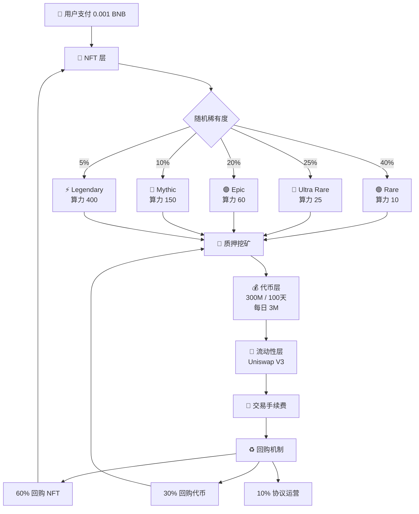

# X413 Protocol

<div align="center">


### 🚀 突破Web2限制，重新定义去中心化协议

[](https://opensource.org/licenses/MIT)
[](https://soliditylang.org/)
[](https://bscscan.com/)
[](https://twitter.com/BEP20X413)

**[🌐 官网](https://x413img.art)** · 
**[🐦 Twitter](https://twitter.com/BEP20X413)** · 
**[💻 GitHub](https://github.com/talonmemancing-sys/X413Protocol-)** · 
**[🖼️ NFT Collection](https://element.market/collections/x413)**

</div>

<br>

---

## 📖 目录

<table>
<tr>
<td width="33%" valign="top">

**🎯 核心内容**
- [项目简介](#-项目简介)
- [为什么选择413](#-为什么是413)
- [核心特性](#-核心特性)
- [价值体系](#-三层价值体系)

</td>
<td width="33%" valign="top">

**💰 经济模型**
- [如何使用](#-如何使用)
- [NFT稀有度](#-nft稀有度系统)
- [代币分配](#-代币分配)
- [质押挖矿](#-质押挖矿机制)

</td>
<td width="33%" valign="top">

**🔗 更多信息**
- [技术架构](#️-技术架构)
- [路线图](#️-路线图)
- [常见问题](#-常见问题)
- [官方链接](#-官方链接)

</td>
</tr>
</table>

<br>

---

## 🌟 项目简介

<div align="center">

### X413 Protocol 是什么？

基于 **X402 协议** 的革命性扩展升级  
灵感源自 **HTTP 413** 错误代码（Payload Too Large）  
利用区块链技术突破 Web2 架构限制  
打造完全去中心化的 NFT 生态系统

</div>

<br>

<table>
<tr>
<td width="50%">

### 🔥 核心亮点

```
✨ 支付 Mint NFT
💎 质押挖矿获得代币
🌊 V3 流动性挖矿
♻️ 完整价值闭环
🔒 防闪电贷保护
🎨 5种稀有度设计
🚀 FOUR内盘抢购
```

</td>
<td width="50%">

### 📊 核心数据

```
💰 Mint 价格: 0.001 BNB
🎁 质押奖励: 300M X413 (30%)
💧 流动性池: 200M X413 (20%)
🔥 FOUR抢购: 500M X413 (50%)
⏱️ 挖矿周期: 100天
📅 每日产出: 3M X413
🔐 最小质押: 24小时
🎯 总供应量: 1B X413
```

</td>
</tr>
</table>

<br>

---

## 💡 为什么是413?

<div align="center">

### HTTP 413: Payload Too Large

在 Web2 世界中，**413 错误** 代表"请求实体过大"  
这是中心化服务器架构的固有限制

### X413 的突破

</div>

<table>
<tr>
<td width="25%" align="center">

### ♾️
**无限扩展**  
区块链分布式架构  
无中心服务器限制

</td>
<td width="25%" align="center">

### 🌐
**完全链上**  
元数据永久存储  
去中心化可验证

</td>
<td width="25%" align="center">

### 🗳️
**社区治理**  
DAO 驱动决策  
社区共建共享

</td>
<td width="25%" align="center">

### 💰
**价值捕获**  
质押 + 流动性  
完整经济闭环

</td>
</tr>
</table>

<br>

---

## ⚡ 核心特性

### 基于 X402 的全面升级

<table>
<tr>
<th width="30%">功能特性</th>
<th width="20%">X402</th>
<th width="20%">X413</th>
<th width="30%">升级说明</th>
</tr>
<tr>
<td><b>NFT 发行</b></td>
<td align="center">✅</td>
<td align="center">✅</td>
<td>增强：支付 mint 机制</td>
</tr>
<tr>
<td><b>质押挖矿</b></td>
<td align="center">❌</td>
<td align="center">✅</td>
<td><b>新功能：NFT 质押获得代币</b></td>
</tr>
<tr>
<td><b>代币经济</b></td>
<td align="center">基础</td>
<td align="center">✅</td>
<td><b>完整经济闭环系统</b></td>
</tr>
<tr>
<td><b>FOUR 内盘</b></td>
<td align="center">❌</td>
<td align="center">✅</td>
<td><b>50% 代币 FOUR 抢购</b></td>
</tr>
<tr>
<td><b>流动性管理</b></td>
<td align="center">❌</td>
<td align="center">✅</td>
<td><b>Uniswap V3 流动性池</b></td>
</tr>
<tr>
<td><b>NFT 回购</b></td>
<td align="center">❌</td>
<td align="center">✅</td>
<td><b>手续费驱动回购机制</b></td>
</tr>
<tr>
<td><b>安全防护</b></td>
<td align="center">基础</td>
<td align="center">✅</td>
<td><b>24小时锁定防闪电贷</b></td>
</tr>
</table>

<br>

---

## 🏗️ 三层价值体系

<div align="center">



</div>

<br>

<div align="center">

### 💫 完整价值闭环

| 步骤 | 动作 | 结果 |
|:---:|:---|:---|
| **1️⃣** | 用户 Mint NFT | 支付 0.001 BNB → 财库 |
| **2️⃣** | 质押 NFT 挖矿 | 获得 X413 代币 → 市场流通 |
| **3️⃣** | FOUR 内盘抢购 | 用户直接抢购 50% 代币 |
| **4️⃣** | 添加 V3 流动性 | 赚取交易手续费 → 回购池 |
| **5️⃣** | 手续费回购 NFT | 销毁/再分配 → 提升稀缺性 |
| **6️⃣** | 回购主代币 | 分配给质押者 → 增加收益 |

</div>

<br>

---

## 🎮 如何使用

<table>
<tr>
<td width="33%" align="center">

### 1️⃣ Mint NFT


**访问官网**  
连接钱包  
支付 0.001 BNB  
获得随机稀有度 NFT

[🚀 立即 Mint](https://x413img.art)

</td>
<td width="33%" align="center">

### 2️⃣ 质押挖矿


**质押 NFT**  
自动开始挖矿  
每日领取 X413  
最少质押 24 小时

[💎 开始质押](https://x413img.art)

</td>
<td width="33%" align="center">

### 3️⃣ FOUR 抢购


**FOUR 内盘**  
直接抢购代币  
50% 供应量  
公平分配机制

[🔥 参与抢购](https://x413img.art)

</td>
</tr>
</table>

<br>

---

## 🎨 NFT稀有度系统

<div align="center">

### 5 种稀有度 · 差异化算力 · 高收益潜力

[**🖼️ 在 Element Market 查看完整系列**](https://element.market/collections/x413)

</div>

<table>
<tr>
<th width="10%">图片</th>
<th width="15%">等级</th>
<th width="20%">名称</th>
<th width="12%">概率</th>
<th width="12%">算力</th>
<th width="31%">预估日收益*</th>
</tr>
<tr>
<td align="center"></td>
<td align="center"><b>🟢 Rare</b></td>
<td><b>Genesis Breaker</b><br/><i>创世破界者</i></td>
<td align="center"><b>40%</b></td>
<td align="center"><b>10</b></td>
<td align="center">~397 X413<br/><small>(≈ 0.004 BNB)</small></td>
</tr>
<tr>
<td align="center"></td>
<td align="center"><b>🔵 Ultra Rare</b></td>
<td><b>Cyber Overflow</b><br/><i>赛博溢出</i></td>
<td align="center"><b>25%</b></td>
<td align="center"><b>25</b></td>
<td align="center">~993 X413<br/><small>(≈ 0.010 BNB)</small></td>
</tr>
<tr>
<td align="center"></td>
<td align="center"><b>🟣 Epic</b></td>
<td><b>Payload Phoenix</b><br/><i>载荷凤凰</i></td>
<td align="center"><b>20%</b></td>
<td align="center"><b>60</b></td>
<td align="center">~2,384 X413<br/><small>(≈ 0.024 BNB)</small></td>
</tr>
<tr>
<td align="center"></td>
<td align="center"><b>🔴 Mythic</b></td>
<td><b>Infinite Buffer</b><br/><i>无限缓冲</i></td>
<td align="center"><b>10%</b></td>
<td align="center"><b>150</b></td>
<td align="center">~5,960 X413<br/><small>(≈ 0.060 BNB)</small></td>
</tr>
<tr>
<td align="center"></td>
<td align="center"><b>⚡ Legendary</b></td>
<td><b>Web3 Liberation</b><br/><i>Web3解放</i></td>
<td align="center"><b>5%</b></td>
<td align="center"><b>400</b></td>
<td align="center">~15,894 X413<br/><small>(≈ 0.159 BNB)</small></td>
</tr>
</table>

<div align="center">

_*基于全网算力 75,500 的估算，实际收益随参与度动态变化_

**收益计算公式**

```
用户日收益 = (用户总算力 / 全网总算力) × 3,000,000 X413
```

</div>

<br>

---

## 💰 经济模型

### 📊 代币分配

<div align="center">

**总供应量: 1,000,000,000 X413**

</div>

<table>
<tr>
<td width="50%">

#### 分配明细

| 用途 | 数量 | 占比 | 说明 |
|:---|---:|:---:|:---|
| 🔥 **FOUR 内盘抢购** | 500,000,000 | **50%** | 用户直接抢购 |
| 🎁 **质押挖矿** | 300,000,000 | **30%** | 100天线性释放 |
| 💧 **流动性池** | 200,000,000 | **20%** | DEX 流动性 |

</td>
<td width="50%">

#### 分配图表

```
     FOUR 内盘抢购
    █████████████████████████ 50%
    
    
     质押挖矿
    ███████████████ 30%
    
    
     流动性池
    ██████████ 20%
    
```

#### 💡 分配特点

✅ **公平分配**: 50% 通过 FOUR 公平抢购  
✅ **长期激励**: 30% 质押挖矿奖励  
✅ **流动性保障**: 20% 提供 DEX 流动性

</td>
</tr>
</table>

<br>

### 🔥 FOUR 内盘抢购机制

<table>
<tr>
<td width="25%" align="center">

#### 💰
**抢购总量**  
500,000,000  
X413 代币  
**(50%)**

</td>
<td width="25%" align="center">

#### ⚡
**抢购方式**  
FOUR 平台  
内盘直接购买

</td>
<td width="25%" align="center">

#### 📅
**抢购时间**  
TGE 时开启  
先到先得

</td>
<td width="25%" align="center">

#### 🎯
**公平机制**  
无预售  
无私募

</td>
</tr>
</table>

<br>

### ⛏️ 质押挖矿机制

<table>
<tr>
<td width="25%" align="center">

#### 💎
**总奖励池**  
300,000,000  
X413 代币  
**(30%)**

</td>
<td width="25%" align="center">

#### ⏱️
**挖矿周期**  
100 天  
线性释放

</td>
<td width="25%" align="center">

#### 📅
**每日产出**  
3,000,000  
X413 代币

</td>
<td width="25%" align="center">

#### 🔒
**最小质押**  
24 小时  
防闪电贷

</td>
</tr>
</table>

<br>

<div align="center">

### 📈 收益预估示例

假设全网总算力 75,500

</div>

<table>
<tr>
<th>持有NFT</th>
<th>总算力</th>
<th>日收益</th>
<th>月收益</th>
<th>100天总收益</th>
</tr>
<tr>
<td>1个 Rare</td>
<td align="center">10</td>
<td align="right">397 X413</td>
<td align="right">11,920 X413</td>
<td align="right">39,735 X413</td>
</tr>
<tr>
<td>1个 Ultra Rare</td>
<td align="center">25</td>
<td align="right">993 X413</td>
<td align="right">29,801 X413</td>
<td align="right">99,338 X413</td>
</tr>
<tr>
<td>1个 Epic</td>
<td align="center">60</td>
<td align="right">2,384 X413</td>
<td align="right">71,523 X413</td>
<td align="right">238,411 X413</td>
</tr>
<tr>
<td>1个 Mythic</td>
<td align="center">150</td>
<td align="right">5,960 X413</td>
<td align="right">178,808 X413</td>
<td align="right">596,026 X413</td>
</tr>
<tr>
<td><b>1个 Legendary</b></td>
<td align="center"><b>400</b></td>
<td align="right"><b>15,894 X413</b></td>
<td align="right"><b>476,821 X413</b></td>
<td align="right"><b>1,589,404 X413</b></td>
</tr>
</table>

<div align="center">

_*以上为理想估算，实际收益会根据全网算力变化而调整_

</div>

<br>

---

## 🏗️ 技术架构

<table>
<tr>
<td width="33%">

### 🎨 NFT 合约

**X413.sol**

✅ ERC721 标准  
✅ 5种稀有度设计  
✅ 链上元数据  
✅ 支付 mint 机制  
✅ 批量操作支持  
✅ 完全去中心化

</td>
<td width="33%">

### 💎 质押合约

**X413Staking.sol**

✅ NFT 质押挖矿  
✅ 防闪电贷保护  
✅ 每日限额产出  
✅ 差异化算力  
✅ 防重入攻击  
✅ 紧急暂停功能

</td>
<td width="33%">

### 🪙 代币合约

**X413Token.sol**

✅ ERC20 标准  
✅ FOUR 内盘集成  
✅ 回购机制  
✅ 流动性管理  
✅ 销毁功能  
✅ 透明可审计

</td>
</tr>
</table>

<br>

<div align="center">

### 🔐 安全特性

| 特性 | 说明 |
|:---|:---|
| **OpenZeppelin** | 使用业界标准安全库 |
| **防重入** | ReentrancyGuard 保护 |
| **防闪电贷** | 24小时最小质押时间 |
| **紧急暂停** | Pausable 应急机制 |
| **多签钱包** | 关键操作需多方确认 |
| **审计计划** | 第三方安全审计进行中 |

</div>

<br>

---

## 🗓️ 路线图

<table>
<tr>
<td width="25%">

### Q1 2025 ✅

**基础建设**

- [x] 智能合约开发
- [x] 内部安全测试
- [x] 官网上线
- [x] 社区建设
- [ ] 主网部署准备

</td>
<td width="25%">

### Q2 2025 🚧

**生态启动**

- [ ] 开启公开 Mint
- [ ] 质押合约上线
- [ ] 代币 TGE
- [ ] FOUR 内盘抢购
- [ ] DEX 流动性添加
- [ ] Element 上架
- [ ] 安全审计完成

</td>
<td width="25%">

### Q3 2025 📋

**生态扩展**

- [ ] V3 池优化
- [ ] 回购机制启动
- [ ] DAO 治理上线
- [ ] 跨链桥开发
- [ ] 移动端 APP
- [ ] 合作伙伴集成

</td>
<td width="25%">

### Q4 2025 🔮

**全球化**

- [ ] Layer2 部署
- [ ] GameFi 集成
- [ ] 元宇宙合作
- [ ] 生态基金启动
- [ ] 全球社区扩展
- [ ] CEX 上市

</td>
</tr>
</table>

<br>

---

## 💬 常见问题

<details>
<summary><b>❓ Mint 一个 NFT 需要多少费用？</b></summary>

<br>

**费用构成:**
- NFT 价格: **0.001 BNB**
- Gas 费: 约 **0.0001-0.0003 BNB**
- 总计约: **0.0011-0.0013 BNB**

</details>

<details>
<summary><b>❓ 什么是 FOUR 内盘抢购？</b></summary>

<br>

**FOUR 内盘抢购:**
- 🔥 **50% 代币** 通过 FOUR 平台发售
- ⚡ **公平机制**: 无预售、无私募
- 🎯 **先到先得**: TGE 时开启抢购
- 💰 **直接购买**: 用户可直接获得代币

这是最公平的代币分配方式！

</details>

<details>
<summary><b>❓ 质押需要锁定多久？</b></summary>

<br>

**最少质押 24 小时**，这是为了：
- 🛡️ 防止闪电贷攻击
- 🤖 防止套利机器人
- 👥 保护诚实质押者利益

24小时后可以随时解除质押，不会损失任何奖励。

</details>

<details>
<summary><b>❓ 每天能挖多少代币？</b></summary>

<br>

**取决于你的算力占比:**

全网每天产出 **3,000,000 X413**

你的日收益 = (你的算力 / 全网算力) × 3,000,000

例如：
- 质押 1 个 Legendary (400算力)
- 全网算力 75,500
- 你的日收益 ≈ **15,894 X413**

</details>

<details>
<summary><b>❓ 代币有什么用途？</b></summary>

<br>

**X413 代币的用途:**
1. 💱 **交易**: 在 DEX 上交易获利
2. 🌊 **流动性**: 添加流动性赚取手续费
3. 🗳️ **治理**: 参与 DAO 投票决策
4. 🎁 **权益**: 享受生态各种权益

</details>

<details>
<summary><b>❓ 手续费如何使用？</b></summary>

<br>

**流动性池交易手续费分配:**
- 60% → 回购 NFT
- 30% → 回购代币分配给质押者
- 10% → 协议运营

形成完整的价值闭环！

</details>

<details>
<summary><b>❓ 合约是否安全？</b></summary>

<br>

**安全措施:**
- ✅ OpenZeppelin 标准库
- ✅ 多重安全防护机制
- ✅ 内部安全审计已完成
- ✅ 第三方审计进行中
- ✅ Bug 赏金计划即将推出

代码完全开源，可在 [GitHub](https://github.com/talonmemancing-sys/X413Protocol-) 查看审计。

</details>

<br>

---

## 🌐 官方链接

<div align="center">

### 核心平台

[](https://x413img.art)
[](https://twitter.com/BEP20X413)
[](https://github.com/talonmemancing-sys/X413Protocol-)
[](https://element.market/collections/x413)

<br>

### 社区渠道

[](#)
[](#)
[](#)

<br>

### 联系方式

📧 **Email**: contact@x413.io  
💼 **Business**: bd@x413.io  
🛠️ **Tech**: dev@x413.io

</div>

<br>

---

## 🛡️ 安全提示

<table>
<tr>
<td width="50%">

### ✅ 务必做到

```
1. 🔐 保护私钥，永不分享
2. 🔍 只使用官方链接
3. ✔️ 验证合约地址
4. 🧪 小额测试后再投入
5. 📚 充分了解风险
6. 💰 只投资可承受损失的金额
```

</td>
<td width="50%">

### ❌ 千万不要

```
1. ⛔ 分享私钥或助记词
2. ⛔ 在不明网站连接钱包
3. ⛔ 相信私信要私钥的"客服"
4. ⛔ 点击可疑链接
5. ⛔ 在未验证的合约授权
6. ⛔ 投入超过承受能力的资金
```

</td>
</tr>
</table>

<br>

---

## 📢 免责声明

<div align="center">

### ⚠️ 风险提示

</div>

X413 Protocol 是一个实验性去中心化协议。请注意：

- 🎲 **投资风险**: 加密货币投资存在高风险，NFT 价格可能大幅波动
- 💻 **技术风险**: 智能合约可能存在未知漏洞，区块链网络可能出现问题
- 📜 **监管风险**: 加密货币监管政策可能变化，请遵守当地法律法规
- 💰 **损失风险**: 请只投资您能承受损失的金额，投资前充分了解风险

**本项目不构成任何投资建议，用户需自行评估风险并为自己的决策负责。**

<br>

---

## 🙏 致谢

感谢以下项目和社区的支持：

<table>
<tr>
<td align="center" width="25%">
<br/>
<b>Binance Smart Chain</b><br/>
高性能区块链基础设施
</td>
<td align="center" width="25%">
<br/>
<b>OpenZeppelin</b><br/>
安全的智能合约库
</td>
<td align="center" width="25%">
<br/>
<b>Uniswap</b><br/>
去中心化交易协议
</td>
<td align="center" width="25%">
<br/>
<b>Element Market</b><br/>
NFT 交易市场
</td>
</tr>
</table>

<br>

---

## 📄 许可证

本项目采用 **MIT License** 开源协议

详见 [LICENSE](./LICENSE) 文件

<br>

---

<div align="center">


## 🚀 加入 X413，一起突破 Web2 限制！

### Breaking Limits. Building Future.

<br>

[](https://twitter.com/BEP20X413)
[](https://github.com/talonmemancing-sys/X413Protocol-)
[](https://x413img.art)

<br>

---

<br>

**© 2025 X413 Protocol. All Rights Reserved.**

Made with ❤️ by the X413 Team

<br>

**[⬆ 回到顶部](#x413-protocol)**

</div>
